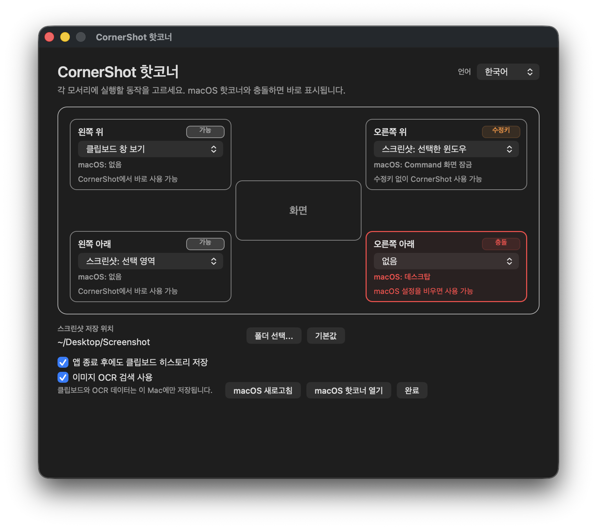

# CornerShot

Hot corners for screenshots and clipboard history on macOS.

CornerShot is a small menu bar app that lets you trigger useful actions by moving your mouse to a screen corner.



## Download

Download the latest zip from [Releases](https://github.com/rlaehrb1/CornerShot/releases).

## Install

1. Download and unzip `CornerShot-v0.1.0.zip`.
2. Move `CornerShot.app` to your Applications folder.
3. Right-click `CornerShot.app` and choose `Open`.
4. Allow Screen Recording permission when macOS asks.
5. Quit CornerShot, then open it again.

CornerShot is locally signed and not notarized yet, so macOS may block the first launch. Right-clicking and choosing `Open` usually fixes that.

## What It Does

- Run actions from the four screen corners.
- Take full screen, selected window, or selected area screenshots.
- Open clipboard history from a corner.
- Search copied text, files, images, and optional local OCR text.
- Detect existing macOS Hot Corner conflicts.
- Switch between English and Korean.

## How To Use

1. Launch CornerShot.
2. Click the CornerShot icon in the macOS menu bar.
3. Open `Hot Corner Settings...`.
4. Choose an action for each corner.
5. Move your mouse to that corner to run it.

If screenshot actions do not work after granting permission, quit CornerShot and open it again.

## Requirements

- macOS 14 or later.
- Screen Recording permission for screenshot features.

## Build From Source

```bash
swift build
```

To build the `.app` bundle:

```bash
just build
```

## Korean

CornerShot은 macOS 메뉴바 앱입니다. 화면 모서리에 마우스를 가져가면 스크린샷, 클립보드 히스토리 같은 동작을 바로 실행할 수 있습니다.

## 설치

1. [Releases](https://github.com/rlaehrb1/CornerShot/releases)에서 최신 zip을 받습니다.
2. 압축을 풀고 `CornerShot.app`을 Applications 폴더로 옮깁니다.
3. `CornerShot.app`을 우클릭한 뒤 `열기`를 선택합니다.
4. macOS가 화면 기록 권한을 요청하면 허용합니다.
5. CornerShot을 종료한 뒤 다시 실행합니다.

현재 앱은 로컬 개발용으로 서명되어 있고 notarization은 되어 있지 않습니다. 처음 실행할 때 macOS가 막으면 우클릭 후 `열기`로 실행하면 됩니다.

## 주요 기능

- 네 모서리마다 다른 동작 지정
- 전체 화면, 선택 창, 선택 영역 스크린샷
- 모서리에서 클립보드 히스토리 열기
- 텍스트, 파일, 이미지, 선택적 로컬 OCR 검색
- macOS 기본 핫코너 충돌 감지
- 영어/한국어 전환

## 사용 방법

1. CornerShot을 실행합니다.
2. 메뉴바의 CornerShot 아이콘을 클릭합니다.
3. `Hot Corner Settings...`를 엽니다.
4. 각 모서리에 원하는 동작을 지정합니다.
5. 마우스를 해당 모서리로 가져가 실행합니다.

권한을 허용했는데 스크린샷이 동작하지 않으면 CornerShot을 종료한 뒤 다시 실행해 주세요.
